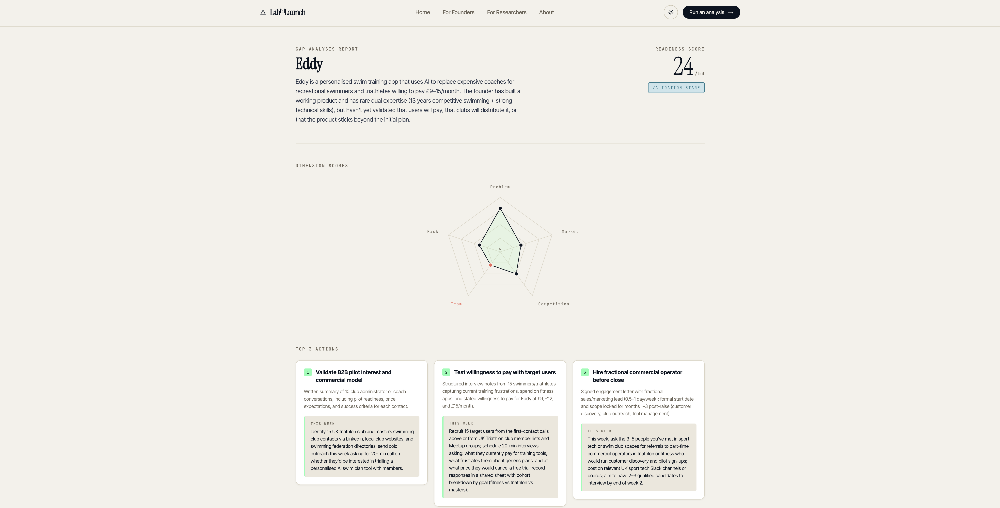
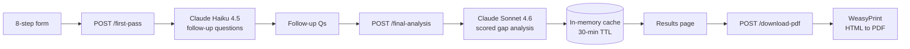

# Lab2Launch

A web app for early-stage technical founders to assess their investor readiness. Fill in a structured form, answer a few clarifying questions, get a scored gap analysis with a five-dimension breakdown and a downloadable PDF.

The differentiator is BA methodology — POPIT, SWOT, and Stakeholder Analysis run inside the prompts, so the output is structured around real diligence frameworks rather than generic advice.



---

## Live demo

`<replace with the Render URL once deployed>`

The free tier sleeps after 15 minutes of inactivity, so the first visit can take ~30 seconds to wake up. Subsequent requests are instant.

---

## Architecture



The app is intentionally **stateless on the server**. There is no database. Completed analyses live in an in-memory dict for 30 minutes — long enough for the user to view their results and download a PDF — and disappear when the session ends or the server restarts.

---

## Why no database

Three reasons:

1. **Privacy by default.** Without a DB there's no shared sidebar, no per-user data sitting on a server, no migration path for any of it to leak. Each analysis is one user, one session, one PDF.
2. **Simpler ops.** No connection strings, no migrations, no backups, no Postgres bill. The app fits on Render's free tier without any external service.
3. **Honest to the use case.** Lab2Launch is a one-shot diagnostic, not a project tracker. Users get the analysis, save the PDF, and move on. A history feature would be feature-creep.

The trade-off: refresh after the 30-minute window and the analysis is gone. The PDF download CTA is prominent on the results page so users don't accidentally lose their report.

---

## Key engineering decisions

- **Two-pass prompting (haiku → sonnet)** rather than a single shot. The first pass uses a fast, cheap model (Haiku 4.5) to read the form inputs and decide which 3–5 follow-up questions will actually sharpen the analysis. Those answers feed the second pass on a stronger model (Sonnet 4.6) for the scored output. Adaptive questioning produces materially better analyses than a one-shot prompt, and keeping the cheap model on the routing job keeps the per-analysis cost low.

- **In-memory cache + magic-link admin** instead of accounts. The user-facing app is anonymous and stateless. The admin dashboard at `/admin` is gated by a magic link sent to a single whitelisted email — no password, no leak surface, no user table to maintain.

- **WeasyPrint for the PDF.** Renders from HTML/CSS, so the PDF can share design tokens with the live results page (cream background, navy ink, lime accents, same priority colours). Earlier hand-laid PDF approaches drifted visually every time the site got updated.

---

## Methodology — encoded BA frameworks

The prompts apply three frameworks invisibly:

- **POPIT** (People, Organisation, Processes, Information, Technology). Each dimension card surfaces POPIT facets via the `framework_tags` field — e.g. a team-execution gap is tagged `POPIT — People`, a data-handling gap is tagged `POPIT — Information`. This forces the analysis to consider all five layers, not just product or market.

- **SWOT.** The `now` / `target` / `gap` columns on every dimension are a structured SWOT in disguise: current state (strengths + weaknesses), target state (opportunities), gap (threats to closing it).

- **Stakeholder Analysis.** Surfaces in the "Top 3 actions" section, where each action has a stakeholder dimension (e.g. *who* needs to be interviewed, *whose* sign-off is needed). The prompts explicitly check for hidden stakeholders the founder hasn't named.

---

## Running locally

Prerequisites:
- Python 3.9+ with a venv
- Node 20+
- WeasyPrint system libs: `brew install pango cairo` (macOS) or `apt-get install libpango-1.0-0 libpangoft2-1.0-0 libharfbuzz0b libcairo2 libfontconfig1` (Debian/Ubuntu)
- Anthropic API key in `.env` at the repo root: `ANTHROPIC_API_KEY=sk-ant-...`

**Backend** (terminal 1):

```bash
python -m venv venv
venv/bin/pip install -r backend/requirements.txt
cd backend
./start.sh
```

**Frontend** (terminal 2):

```bash
cd frontend
npm install
npm run dev
```

Open `http://localhost:5173`. Vite proxies API calls to the FastAPI backend on `:8000`.

---

## Deploying

The repo includes a `render.yaml` for one-click deploy to Render:

1. Connect the repo on render.com and select the existing `render.yaml` config.
2. Set required env vars in the Render dashboard:
   - `ANTHROPIC_API_KEY` — from console.anthropic.com
   - `SESSION_SECRET` — any random 32+ char string (used to sign admin cookies)
   - `RESEND_API_KEY` — from resend.com (used for the admin magic-link email)
3. Deploy. The build apt-installs the WeasyPrint deps, builds the frontend, and pip-installs the backend.

The free plan sleeps after 15 minutes idle (~30s cold start). Paid Starter ($7/mo) keeps the service warm if the cold start hurts.

---

## Admin dashboard

`/admin` shows live operational metrics — spend (today/week/month/session), volume, p95 latency per route, last-24h errors, and the last 20 completed analyses. Sign-in is by magic link to a whitelisted email. State is in-memory and resets on server restart.

---

## About

Built by [Toby Redshaw](https://www.linkedin.com/in/toby-redshaw/).
