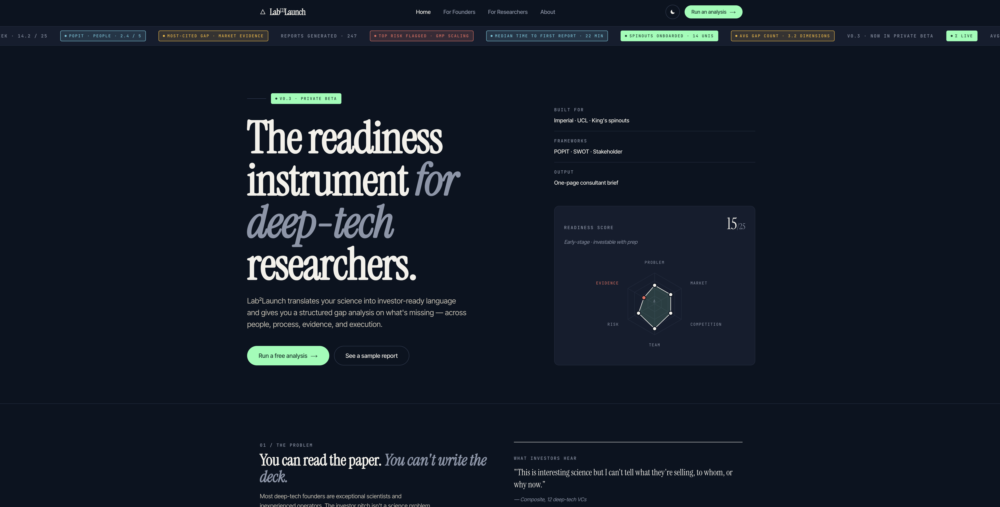
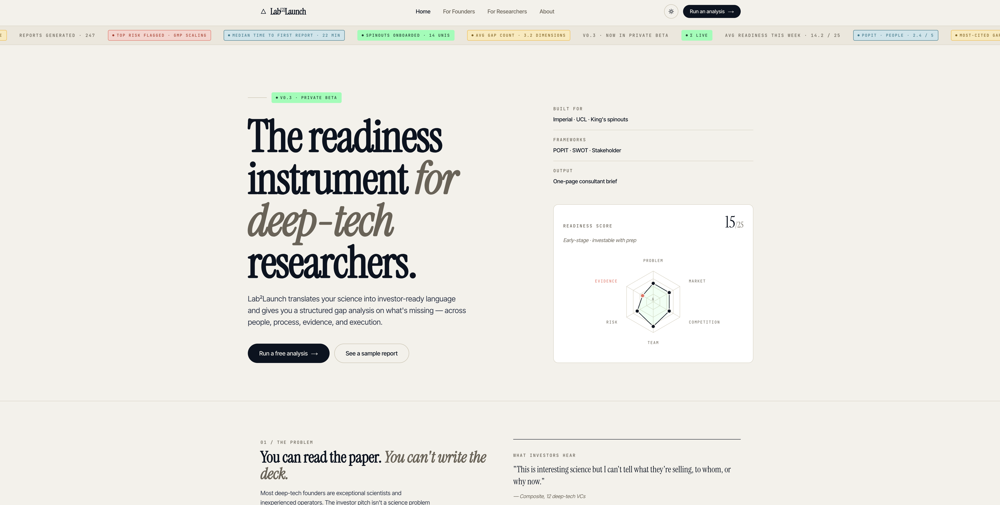
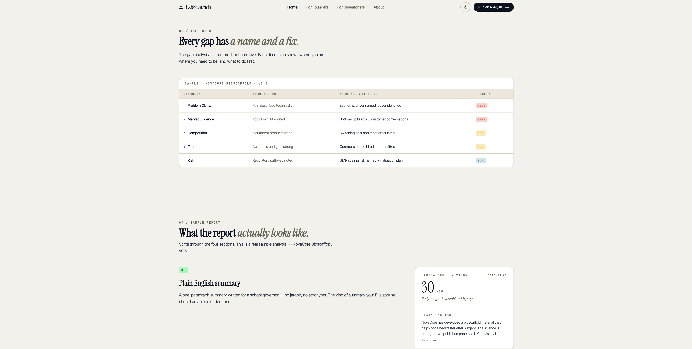
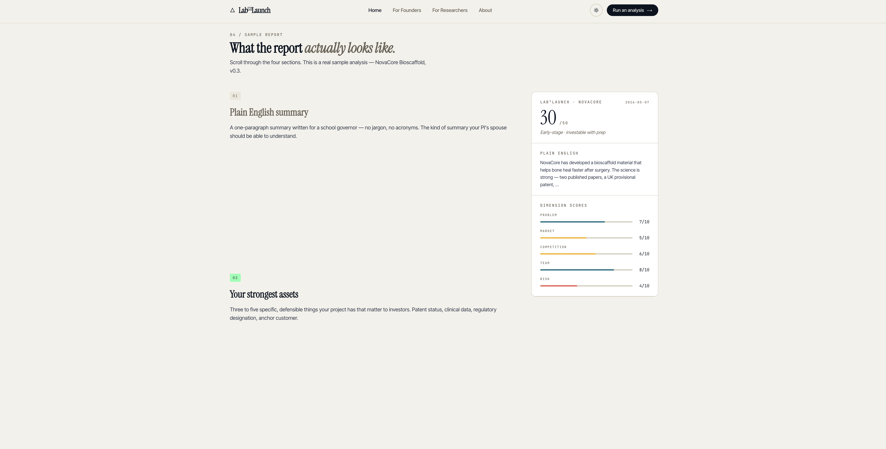
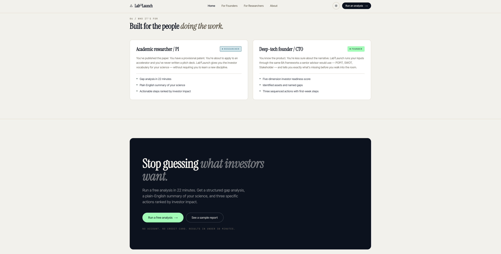
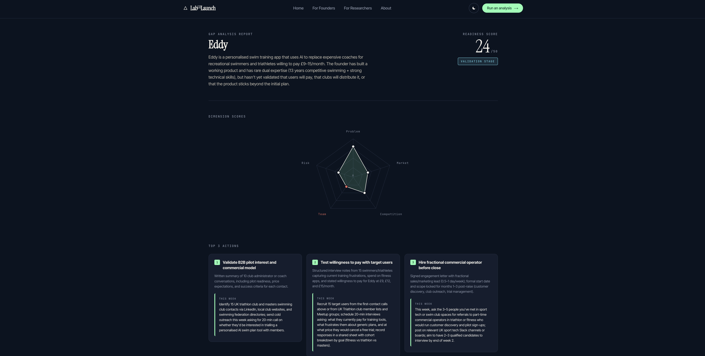
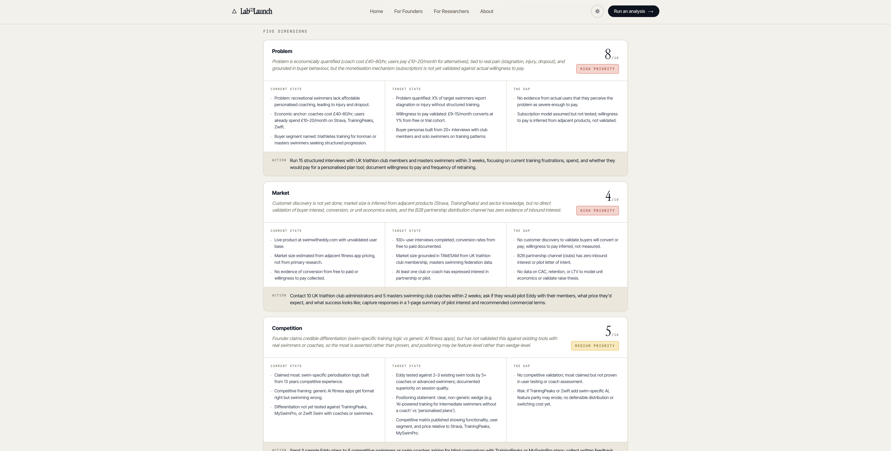
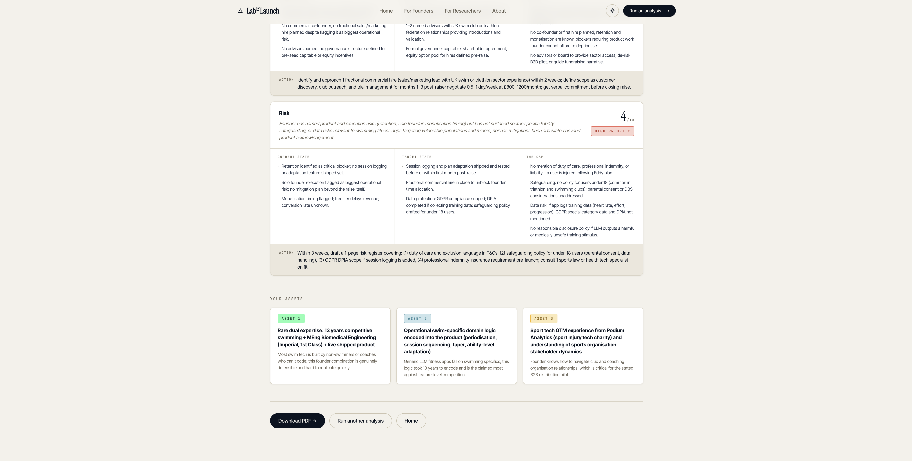

# Lab2Launch

**Research → Investor-Ready**

A web app that helps deep tech and biomedical researchers translate their science into investor-ready language — and get a structured gap analysis on exactly what's missing to bring their technology to market.

---

## Screenshots

### Landing Page

| Dark mode | Light mode |
|---|---|
|  |  |

### Gap Analysis Table



### Live Report Preview



### Who It's For + CTA



### Results Page

| Light mode | Dark mode |
|---|---|
|  |  |





---

## What It Does

Most researchers can articulate the science. Almost none can articulate the business. Lab2Launch bridges that gap using formal Business Analysis frameworks (POPIT, SWOT, Business Case Structure) encoded into a Claude-powered prompt architecture — not visible to the user, but running underneath everything.

**Input:** A short intake form + 5 adversarial investor questions  
**Output:** A structured gap analysis report with readiness scores, current vs. target state, and prioritised actions

---

## The BA Framework Engine

The differentiation is not the LLM — it's the schema. The prompt architecture encodes:

- **POPIT Model** (People, Organisation, Process, Information, Technology) applied to commercialisation gaps
- **SWOT** for competitive positioning
- **Business Case Structure** (costs, benefits, risks, feasibility) applied to the commercialisation decision
- **Stakeholder Analysis** — buyers, users, influencers, and blockers in the target market

The researcher never sees these frameworks. They answer questions. The frameworks do the work underneath.

---

## Tech Stack

| Component | Choice |
|---|---|
| Backend | Python 3.9 + FastAPI + Uvicorn |
| Frontend | React 18 + Vite 5 + TypeScript (strict) |
| LLM | Anthropic Claude API (haiku first pass, haiku/sonnet final) |
| PDF | fpdf2 |
| DB | SQLAlchemy + SQLite |
| Deployment | Railway / Render |

---

## Running Locally

**Backend:**
```bash
cd backend
./start.sh
# FastAPI at http://127.0.0.1:8000
# Requires ANTHROPIC_API_KEY in .env at repo root
```

**Frontend:**
```bash
cd frontend
npm install
npm run dev
# Vite dev server at http://localhost:5173
# Proxies /first-pass, /final-analysis, /download-pdf → localhost:8000
```

**Production build:**
```bash
cd frontend && npm run build
# Output in frontend/dist/ (~89KB gzipped)
```

---

## Product Structure

**Narrative Translation + Gap Analysis**  
Plain English research translation, 5-dimension gap analysis, top 3 prioritised actions.

**Investor Stress Test**  
5 adversarial questions that mirror investor/accelerator panels. Answers feed into the analysis.

---

## Target User

PhD/postdoc or university spinout founder (pre-seed or seeking first investment). Strong on science, weak on: problem framing, market sizing, GTM strategy, and investor narrative.

Primary ecosystem: Imperial College London, UCL, King's College London spinouts in medical devices, biomedical engineering, and deep tech.

---

## About

Built by Toby Redshaw — MEng Biomedical Engineering (Imperial, 1st Class), BCS Foundation Certificate in Business Analysis, Business Analyst at Podium Analytics, and solo founder of [Eddy](https://swimwitheddy.com).
